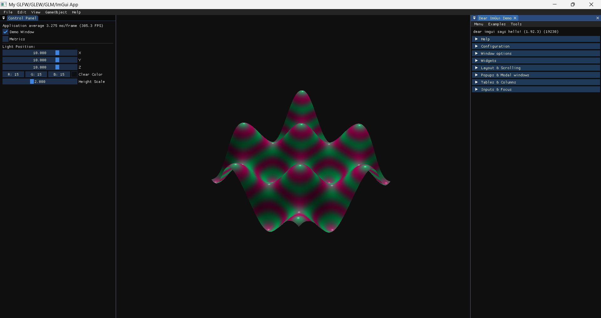

# OpenGL CMake Starter Project

[](https://travis-ci.org/gabriel-aplok/opengl-cmake-starter-project)

A modern C++11 template for OpenGL projects using **GLFW**, **GLEW**, **GLM** and **ImGui**, with support for cross-platform development. This project leverages FetchContent for dependency management and includes a `Shader` class and a sample `Application` for rapid prototyping.

## Features

- Cross-platform support: **Linux**, **Windows**, and **macOS**
- Preconfigured CMake build system
- Example application with shader-based heightmap rendering
- Clean, extensible codebase with modern C++ practices
- ImGui included for interactive UI elements
- MIT License for open collaboration



Contributions and feedback are welcome! Feel free to open issues or submit pull requests.

## Prerequisites

- **CMake** (>= 3.28)
- **Git** (for cloning)
- Platform-specific dependencies (see below)

## Cloning the Repository

Clone the repository:

```bash
git clone git@github.com:gabriel-aplok/opengl-cmake-starter-project.git
```

## Build Instructions

### Linux

1. Install dependencies:

   ```bash
   sudo apt-get update
   sudo apt-get install cmake libxrandr-dev libxinerama-dev libxcursor-dev libxi-dev libgl1-mesa-dev libglu1-mesa-dev g++ ninja-build
   ```

2. Build and run:
   ```bash
   cd opengl-cmake-starter-project
   mkdir build
   cd build
   cmake -G Ninja -DCMAKE_BUILD_TYPE=Debug ..
   ninja
   ./opengl-cmake-starter-project
   ```

### Windows

1. Install CMake (version 3.28 or later) and a C++ compiler (e.g., Visual Studio 2022 Community with Desktop Development with C++ workload).
2. Clone the repository (as above).
3. Use CMake with Ninja or Visual Studio:
   - **With Ninja**:
     ```bash
     mkdir build
     cd build
     cmake -G Ninja -DCMAKE_BUILD_TYPE=Debug ..
     ninja
     opengl-cmake-starter-project.exe
     ```
   - **With Visual Studio**:
     ```bash
     mkdir build
     cd build
     cmake .. -G "Visual Studio 17 2022" -A x64
     cmake --build . --config Debug
     Debug\opengl-cmake-starter-project.exe
     ```
4. Run the generated executable from the build directory.

### macOS

1. Install dependencies using Homebrew:

   ```bash
   brew update
   brew install cmake ninja glfw glew glm
   ```

2. Build and run:
   ```bash
   cd opengl-cmake-starter-project
   mkdir build
   cd build
   cmake -G Ninja -DCMAKE_BUILD_TYPE=Debug ..
   ninja
   ./opengl-cmake-starter-project
   ```

## Project Structure

- **`src/`**: Core application and shader management code
- **`shader/`**: GLSL vertex and fragment shaders
- **`CMakeLists.txt`**: CMake configuration for building the project
- **`CMakePresets.json`**: CMake configuration file defining build rules, dependencies, and targets for cross-platform compilation.
- **`output.png`**: Example output of the heightmap rendering

## Contributing

1. Fork the repository.
2. Create a feature branch (`git checkout -b feature/your-feature`).
3. Commit changes (`git commit -m "Add your feature"`).
4. Push to the branch (`git push origin feature/your-feature`).
5. Open a pull request.

## License

This project is licensed under the [MIT License](LICENSE).
